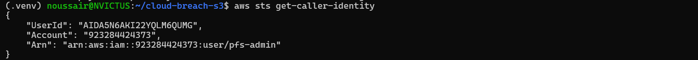
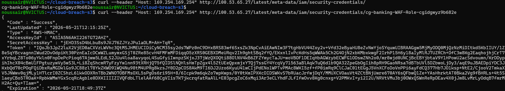
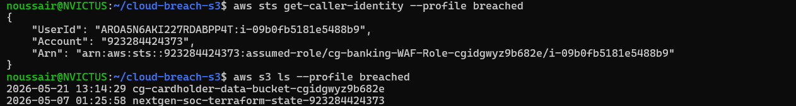
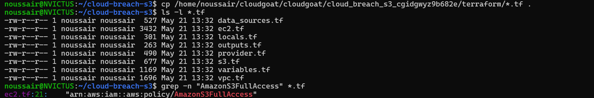
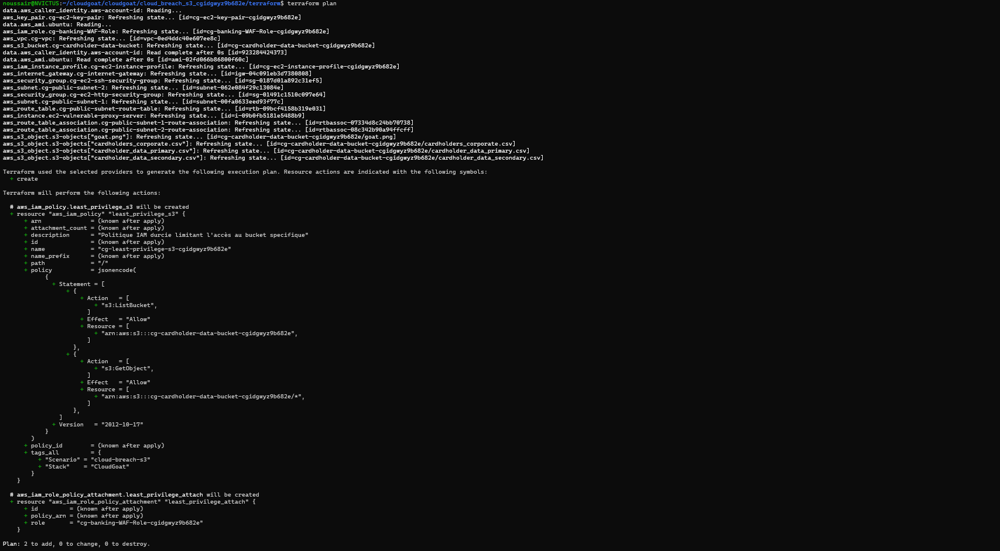
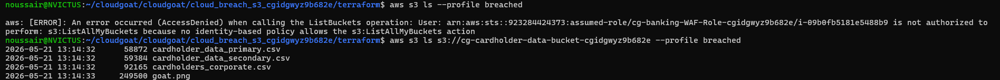
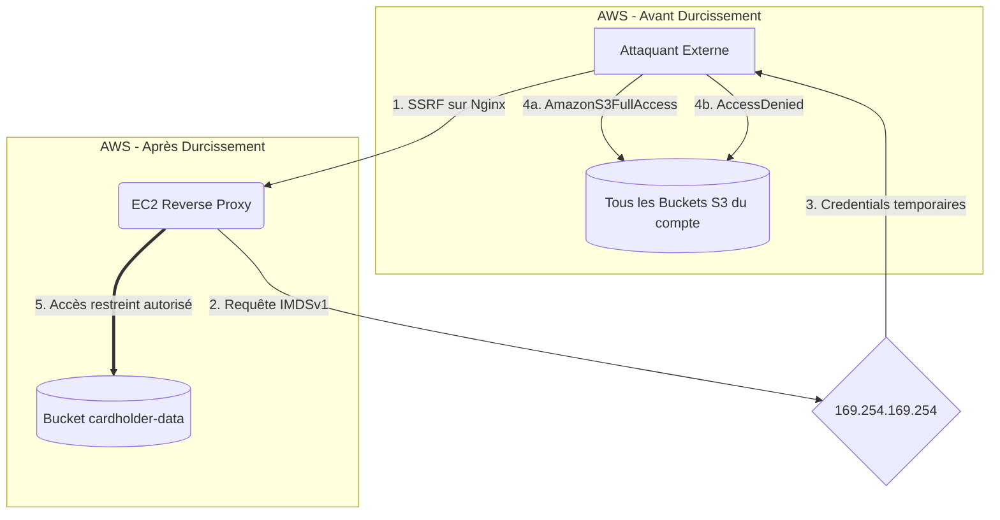

# 🛡️ PFS — Cloud Breach S3
> Scénario : `cloud_breach_s3` — CloudGoat by RhinoSecurityLabs

---

## 📋 Résumé

Ce projet documente le cycle complet **Red Team → Audit IaC → Blue Team** sur une infrastructure AWS volontairement vulnérable. L'objectif principal n'est pas l'attaque, mais la **remédiation automatisée via Terraform** et l'application du **principe du moindre privilège (Least Privilege)**.

---

## Architecture du dépôt

.
├── assets/             # Fichiers de configuration déployés sur l'instance EC2
├── image_durci/        # Preuves visuelles (PoC + validation du correctif)
├── terraform/          # Code IaC durci (Infrastructure as Code)
└── README.md

> ⚠️ Le fichier `terraform.tfvars` est exclu du dépôt via `.gitignore` (contient des données sensibles locales).

---

## Étape 1 — Reconnaissance & État initial

Vérification de l'environnement de travail avec le profil administrateur `pfs-admin` avant tout déploiement. Aucun credentials résiduel d'une session précédente.



---

##  Étape 2 — Exploitation de la vulnérabilité SSRF

Le proxy **Nginx** de l'instance EC2 cible (`100.53.65.27`) est mal configuré : il relaie les requêtes HTTP sans filtrer la destination. Cette faille **SSRF (Server-Side Request Forgery)** permet d'interroger le service de métadonnées AWS (**IMDSv1**) à l'adresse locale `169.254.169.254`.

**Commandes d'exploitation :**
```bash
# 1. Découverte du rôle IAM attaché à l'instance
curl --header "Host: 169.254.169.254" http://100.53.65.27/latest/meta-data/iam/security-credentials/

# 2. Extraction des credentials temporaires
curl --header "Host: 169.254.169.254" http://100.53.65.27/latest/meta-data/iam/security-credentials/cg-banking-WAF-Role-<CGID>
```



---

## 🚨 Étape 3 — Impact critique : Pillage S3

En configurant un profil AWS (`breached`) avec les `AccessKeyId`, `SecretAccessKey` et `SessionToken` volés, l'identité du rôle EC2 est totalement usurpée. L'impact est **critique** : le rôle possède `AmazonS3FullAccess`, permettant de **lister tous les buckets S3 du compte AWS**, y compris des projets sensibles non liés au scénario.

```bash
aws sts get-caller-identity --profile breached
aws s3 ls --profile breached
```



---

## 🔍 Étape 4 — Audit de l'Infrastructure as Code (IaC)

Analyse du code source Terraform généré par CloudGoat. La commande suivante révèle instantanément la cause racine :

```bash
grep -n "AmazonS3FullAccess" *.tf
# ec2.tf:21:    "arn:aws:iam::aws:policy/AmazonS3FullAccess"
```

**Faille identifiée :** Le rôle IAM `cg-banking-WAF-Role` se voit attribuer la politique managée `AmazonS3FullAccess` — accordant `s3:*` sur `*` (toutes les actions sur tous les buckets du compte).



---

## 🔧 Étape 5 — Remédiation & Durcissement (DevSecOps)

### Correctif appliqué dans `terraform/ec2.tf`

Suppression de la politique permissive et création d'une politique IAM **sur mesure** appliquant le **Principe du Moindre Privilège** :

```hcl
# Politique IAM durcie — Accès restreint au bucket applicatif uniquement
resource "aws_iam_policy" "least_privilege_s3" {
  name        = "cg-least-privilege-s3-${var.cgid}"
  description = "Politique IAM durcie limitant l'accès au bucket specifique"

  policy = jsonencode({
    Version = "2012-10-17"
    Statement = [
      {
        Effect   = "Allow"
        Action   = ["s3:ListBucket"]
        Resource = [aws_s3_bucket.cg-cardholder-data-bucket.arn]
      },
      {
        Effect   = "Allow"
        Action   = ["s3:GetObject"]
        Resource = ["${aws_s3_bucket.cg-cardholder-data-bucket.arn}/*"]
      }
    ]
  })
}

resource "aws_iam_role_policy_attachment" "least_privilege_attach" {
  role       = aws_iam_role.cg-banking-WAF-Role.name
  policy_arn = aws_iam_policy.least_privilege_s3.arn
}
```

**Plan d'exécution Terraform confirmant le correctif :**



---

## ✅ Étape 6 — Validation de la sécurité

Après `terraform apply`, deux tests prouvent l'efficacité du durcissement :

| Test | Commande | Résultat attendu |
|------|----------|-----------------|
| Accès global bloqué | `aws s3 ls --profile breached` | ❌ `AccessDenied` |
| Accès métier conservé | `aws s3 ls s3://cg-cardholder-data-bucket-<CGID> --profile breached` | ✅ Liste les fichiers |



---

##  Diagramme de flux — Avant / Après durcissement


---

## 🛠️ Technologies utilisées

| Outil | Usage |
|-------|-------|
| **Terraform** | Infrastructure as Code — déploiement et durcissement |
| **AWS IAM** | Gestion des identités et des politiques d'accès |
| **AWS S3** | Stockage des données sensibles (fictives) |
| **AWS EC2** | Instance proxy vulnérable |
| **CloudGoat** | Framework de lab sécurité AWS (RhinoSecurityLabs) |
| **AWS CLI** | Validation des tests d'accès |

---

## Concepts clés abordés

- **SSRF (Server-Side Request Forgery)** : exploitation d'un proxy mal configuré
- **IMDSv1 vs IMDSv2** : vulnérabilité du service de métadonnées AWS (v1 sans token)
- **IAM Least Privilege** : restriction des droits au strict nécessaire
- **IaC Hardening** : correction des failles directement dans le code Terraform
- **Terraform State Management** : gestion de l'état pour la mise à jour d'infrastructures existantes

---

## ⚙️ Déploiement

```bash
# 1. Cloner le dépôt
git clone https://github.com/NoussairBN/cloud-breach-s3.git
cd cloud-breach-s3

# 2. Créer le fichier de variables (ne jamais committer ce fichier)
cat <<EOF > terraform.tfvars
profile      = "default"
cgid         = "<votre-cgid>"
cg_whitelist = ["<votre-ip>/32"]
EOF

# 3. Initialiser et déployer
cd terraform
terraform init
terraform plan
terraform apply
```

> ⚠️ Cette infrastructure est **intentionnellement vulnérable** à des fins éducatives. Ne jamais déployer en environnement de production.

---

*Projet réalisé dans le cadre du PFS — ENSA Marrakech, 2025-2026*
